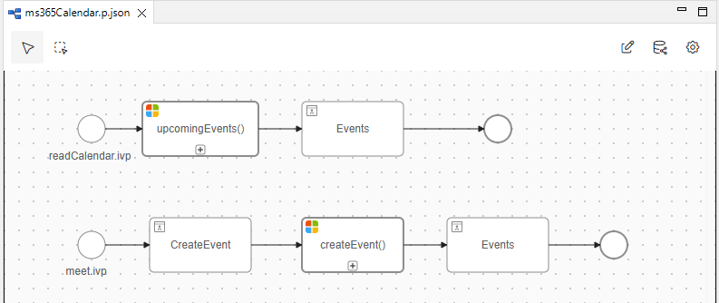

# Microsoft 365 Kalender Konnektor
Axon Ivy’s [Microsoft Outlook Calendar API](https://docs.microsoft.com/en-us/graph/outlook-calendar-concept-overview)
Konnektor integriert Microsoft Outlook Kalenderfunktionen in deine Axon Ivy Geschäftsprozesse. 

Dieser Konnektor:

- Ist Teil der Microsoft Graph REST API.
- Ermöglicht Entwicklern mit geringem Programmieraufwand die Erweiterung bestehender Geschäftsprozesse mit Featuren von Microsoft Office Kalender

## Demo

